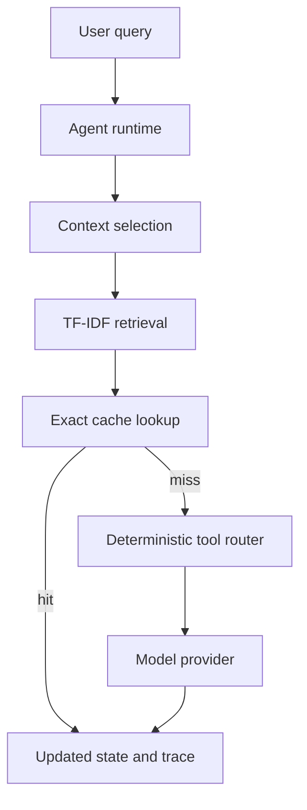

# AgentRuntime-Lab

**A reproducible research prototype for context, retrieval, tool routing, and caching in LLM agent runtimes.**

[](https://github.com/tajahuja/AgentRuntime-Lab/actions/workflows/tests.yml)

[](LICENSE)

## What is the research problem?

Multi-step AI agents repeatedly manage conversation state, retrieve evidence, route tools, and call a model. This project studies a narrow systems question:

> Can explicit context management, deterministic tool routing, retrieval, and exact response caching reduce repeated computation and latency in multi-step agents without degrading answer quality?

The hypothesis is that exact caching reduces repeated provider work for identical inputs, bounded history reduces the context carried forward, and retrieval/tools improve completion on tasks for which they supply required information. The included local provider is deterministic, so answer checks are limited to a small fixture task set and do not establish quality for a real LLM.

## What did I build?

An independent educational research prototype with inspectable runtime state and execution traces. It includes:

- typed conversation, retrieval, tool, response, evaluation, and trace records
- bounded or unbounded conversation history
- a standard-library TF-IDF retrieval baseline
- deterministic calculator and exact-key knowledge-base tools
- rule-based tool routing that can be switched off
- exact response caching keyed by query, selected history, evidence, and provider/tool-policy identity
- a deterministic offline provider and an optional OpenAI-compatible chat-completions provider
- a fixed workload and benchmark runner that writes machine-readable results

The project does not implement model KV-cache reuse, semantic caching, asynchronous agents, model serving, or inference kernels.

## How was it evaluated?

The benchmark replays the same five tasks five times. Conversation history resets between workflows while the response cache persists. It compares cache off/on, full/bounded history, retrieval off/on, and deterministic routing off/on. System measurements include latency, call counts, cache hit rate, and selected-history character count. The deterministic quality checks are fixed expected substrings and gold document IDs.

The checked-in run used Python 3.12.14 on Linux. Measurements are saved in [`results/benchmark_results.json`](results/benchmark_results.json); definitions and caveats are in [`docs/methodology.md`](docs/methodology.md).

## What did the experiments show?

| Experiment | Configuration | Observed result |
|---|---|---|
| Exact response cache | Off → on, 25 requests | Provider calls 25 → 5; cache hit rate 0% → 80%; tool calls 10 → 2; task completion stayed 100% on this fixture workload. Mean latency was 0.0428 ms → 0.0324 ms and p95 was 0.0637 ms → 0.0414 ms in this run. These tiny wall-clock timings are noisy and do not establish a general latency improvement. |
| History selection | Full → last four messages | Mean selected-history size 419.4 → 263.2 characters (about 37% lower); task completion stayed 100% on this workload. |
| Retrieval | Off → on | Task completion 40% → 100%; gold-document hit rate 0% → 75%. This only describes four hand-authored retrieval tasks and the included lexical retriever. |
| Tool routing | Off → on | Task completion 60% → 100% on the fixed workload; routed executions made 10 tool calls. This compares rule-based routing with no tool results, not with model-selected function calls. |

All configurations produced identical repeated answers within each replayed workflow. Exact-match rate was 0% because the checks use required substrings rather than full-output gold strings. The observed completion differences are deterministic fixture checks, not broad answer-quality evidence. The cache experiment demonstrates fewer provider calls, but the measured latency is too small and variable to claim an end-to-end speedup.

## Architecture



## Reproduce

Requires Python 3.11 or later.

```bash
git clone https://github.com/tajahuja/AgentRuntime-Lab.git
cd AgentRuntime-Lab
python -m venv .venv
# macOS/Linux
source .venv/bin/activate
# Windows PowerShell: .venv\Scripts\Activate.ps1
python -m pip install -e ".[test]"
python -m pytest -q
python examples/demo.py
python -m agent_runtime.benchmark --repetitions 5
```

The runtime and benchmark use only the Python standard library; pytest is installed for tests. The benchmark writes to `results/benchmark_results.json` by default. Use `--output /path/to/file.json` to keep a separate run.

### Optional API-backed example

The OpenAI-compatible provider is optional and was not used to produce the checked-in results. **Not executed in the current environment:** an API-backed benchmark, because no API-backed evaluation configuration was set for the recorded run. Set these environment variables in your shell; do not commit credentials:

```bash
export OPENAI_API_KEY="..."
export OPENAI_MODEL="your-model-name"
# Optional for another compatible endpoint:
export OPENAI_BASE_URL="https://api.openai.com/v1"
python examples/llm_demo.py
```

The provider can return token usage when the endpoint includes usage fields. API-backed quality evaluation has not been run or included.

## Research context

This work is conceptually related to agent orchestration, retrieval-augmented generation, and runtime state management. Yandex Research's [“The KV cache as an agent runtime”](https://research.yandex.com/blog/the-kv-cache-as-an-agent-runtime) studies model KV state, shared attention views, and inference-runtime scheduling. AgentRuntime-Lab explores explicit state and completed-response reuse at the application layer. It does **not** reproduce the Yandex work or manipulate model KV state. More detail and primary references are in [`docs/research_notes.md`](docs/research_notes.md).

## Limitations and next research steps

This prototype has a five-task hand-written dataset, lexical retrieval, an offline fixture provider, and an in-memory exact cache. Local timing excludes model inference, tokenization, network, and GPU work. Task-completion and retrieval checks are narrow deterministic metrics. The cache is unbounded and single-process. The optional API integration and token accounting were not exercised in the recorded run.

Useful next steps include a reviewed larger evaluation set, paired API-backed quality and token measurements, real function-calling comparisons, token-aware context budgeting, cache eviction/invalidation experiments, and repeated randomized timing trials. See [`docs/limitations.md`](docs/limitations.md).

## Repository status

This is an independent educational research prototype. Results are a local reproducible baseline, not peer-reviewed findings or a claim of novelty. Citation metadata is provided in [`CITATION.cff`](CITATION.cff); the project is MIT-licensed.
